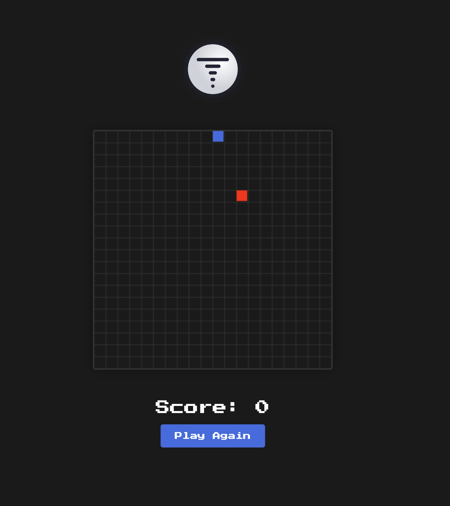

# Snake Game

A simple Snake game implementation using TypeScript, React and HTML5 Canvas, featuring a bot that figures out how to navigate the board.

## Features

- Classic Snake gameplay with arrow key controls
- Responsive canvas-based rendering
- Score tracking
- Game over detection and restart functionality
- Modern React components with TypeScript
- Retro-style pixelated design

## Getting Started

1. Install dependencies: `bash
npm install   `

2. Start the development server: `bash
npm run dev   `

3. Open your browser and navigate to: `http://localhost:5173  `

## Building for Production

1. Create a production build: `bash
npm run build   `

2. Preview the production build: `bash
npm run preview   `

## Controls

- Use arrow keys to control the snake's direction
- Press any arrow key to start moving
- Collect red food blocks to grow and increase your score
- Avoid hitting the walls or the snake's own body

## Tech Stack

- React 18
- TypeScript
- HTML5 Canvas
- Vite
- CSS3
